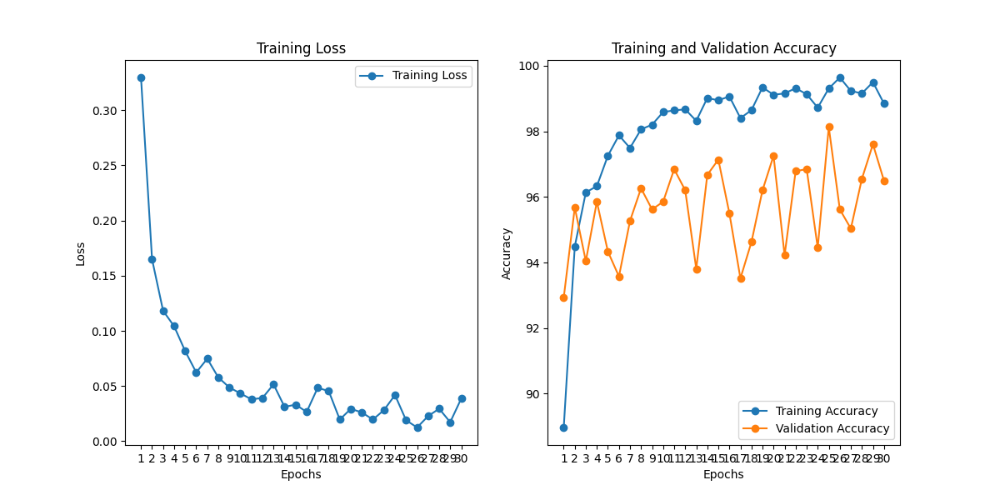
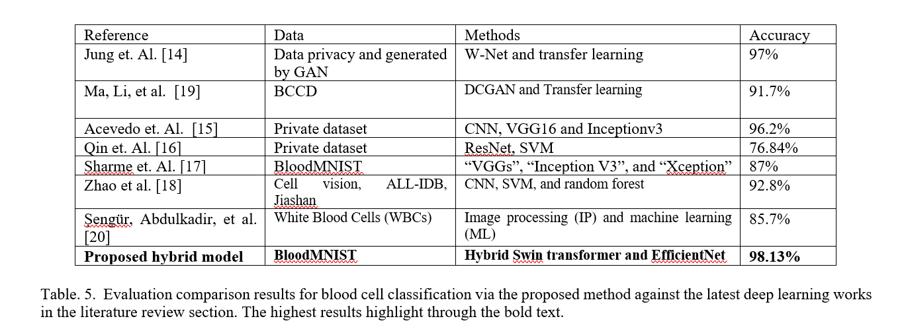
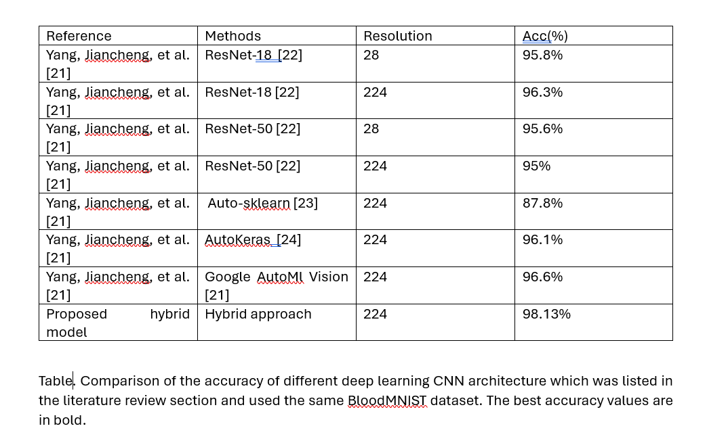

# EfficientSwin
### **EfficientSwin: A Hybrid Model for Blood Cell Classification with saliency maps visualization**
.png)
> **Abstract:** *Blood cell (BC) classification holds significant importance in medical diagnostics as it enables the identification and differentiation of various types of BCs, which is crucial for detecting specific infections, disorders, or conditions, and guiding appropriate treatment decisions. Accurate BC classification simplifies the evaluation of immune system performance and the diagnosis of various ailments such as infections, leukemia, and other hematological disorders. Deep learning algorithms perform excellently in the automated identification and differentiation of various types of BCs. One of the advanced deep learning models, EfficientNet has shown remarkable performance with limited datasets, another model Swin Transformer’s capability to capture intricate patterns and features makes it more accurate, albeit with limitations due to its large number of parameters. However, medical image datasets are often limited, necessitating a solution that balances accuracy and efficiency. To address this, we propose a novel hybrid model, EfficientSwin, which combines Swin Transformer’s and EfficientNet’s strengths. We first fine-tuned the Swin Transformer on a blood cell dataset comprising wihite blood cells, red blood cells and platelets, achieving promising outcomes. Subsequently, our hybrid model, EfficientSwin, outperformed the standalone Swin Transformer, achieving an impressive 98.14\% accuracy in blood cell classification. Furthermore, we compared our approach with previous research on white blood cell datasets, showcasing the superiority of EfficientSwin in accurately classifying blood cells.  Additionally, we utilized saliency maps to visually represent the classification results.* 
<hr />

## Installation
1. Install timm to load pretrained models
```shell
pip install timm
```
2. Install dataset bloodMNIST from medMNIST
```shell
pip install medmnist
```
3. Check available dataset
```shell
python -m medmnist available
```

<hr />

## Base model training 
Download the pretrained weights and run the following command for evaluation and training of base models on bloodMNIST dataset.
1. Swin transformer 
```shell
python Swin.py --batch_size 32 --epochs 35 --lr 0.001 --save_fig training_validation_accuracy_swin.png
```
2. EfficientNet-B0 
```shell
python EfficientNet_b0.py --batch_size 32 --epochs 35 --lr 0.001 --save_fig training_validation_accuracy_Eb0.png
```
3. EfficientNet-B1 
```shell
python python EfficientNet_b1.py --batch_size 32 --epochs 35 --lr 0.001 --save_fig training_validation_accuracy_Eb1.png
```
3. EfficientNet-B2 
```shell
python python EfficientNet_b2.py --batch_size 32 --epochs 35 --lr 0.001 --save_fig training_validation_accuracy_Eb2.png
```
3. EfficientNet-B3 
```shell
python python EfficientNet_b3.py --batch_size 32 --epochs 35 --lr 0.001 --save_fig training_validation_accuracy_Eb3.png
```

<hr />

## Evaluation
Download the pretrained weights and run the following command for evaluation and training of proposed hybrid model on bloodMNIST dataset.
```shell
python EfficientSwin.py --batch_size 32 --epochs 35 --lr 0.001 --save_fig training_validation_accuracy.png
```
<hr />

## Model performance  


## Comparison with Previous models on blood cell calssification


## Comparison with previoud models on bloodMNIST dataset



## REFERENCES


